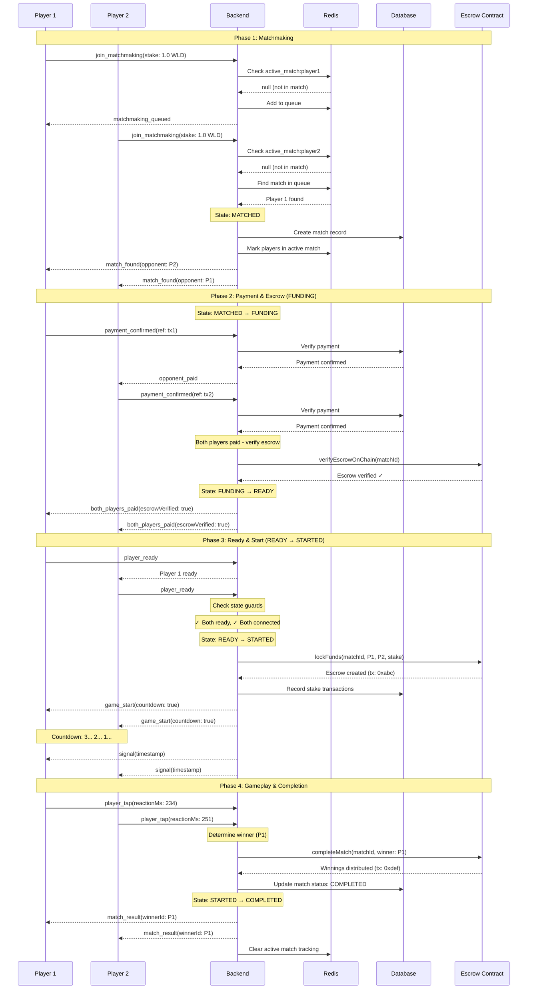
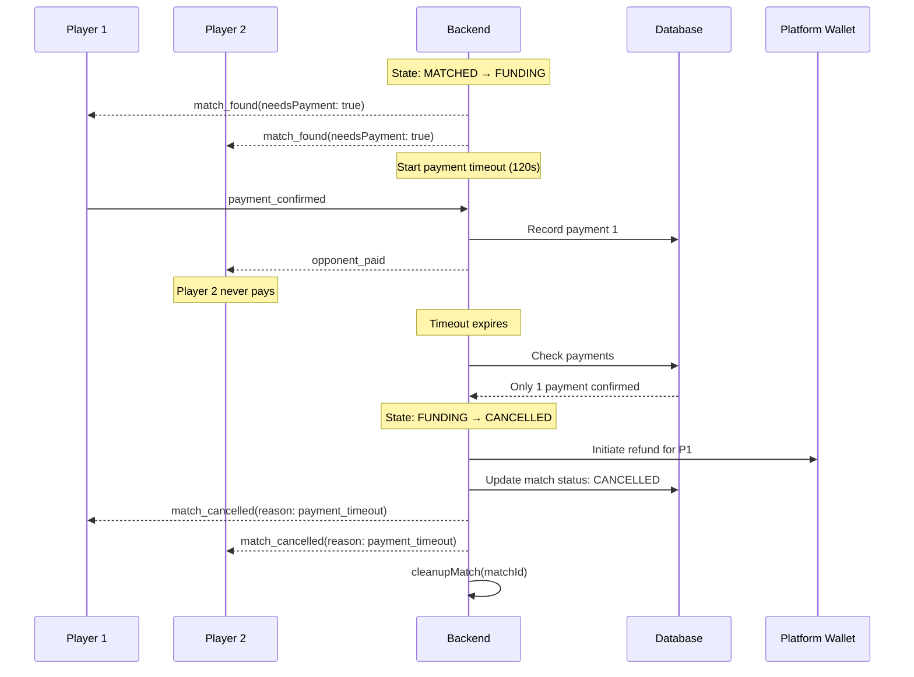
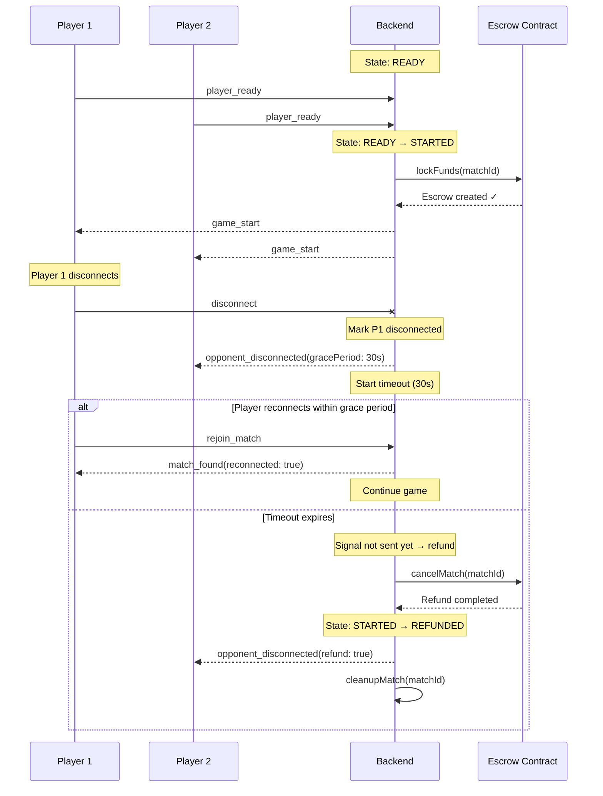
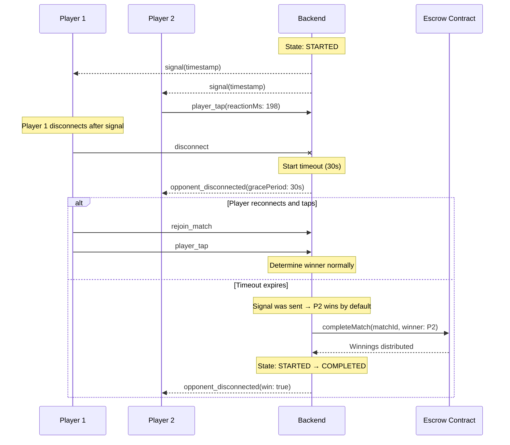
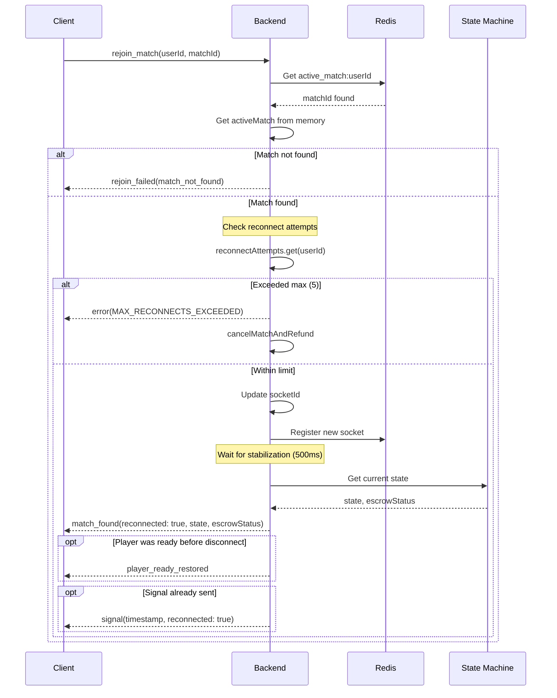
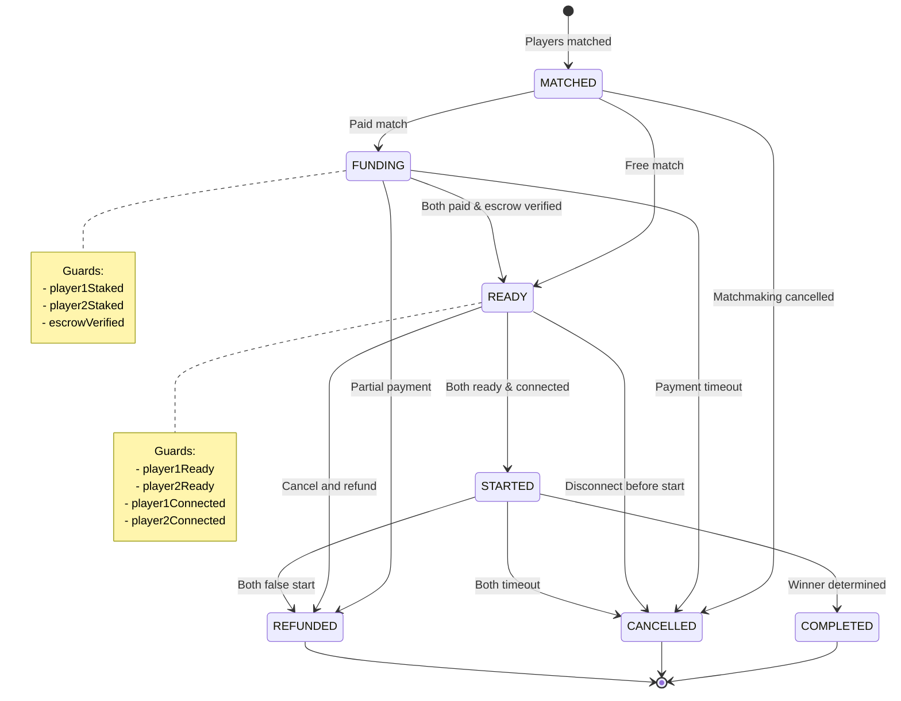
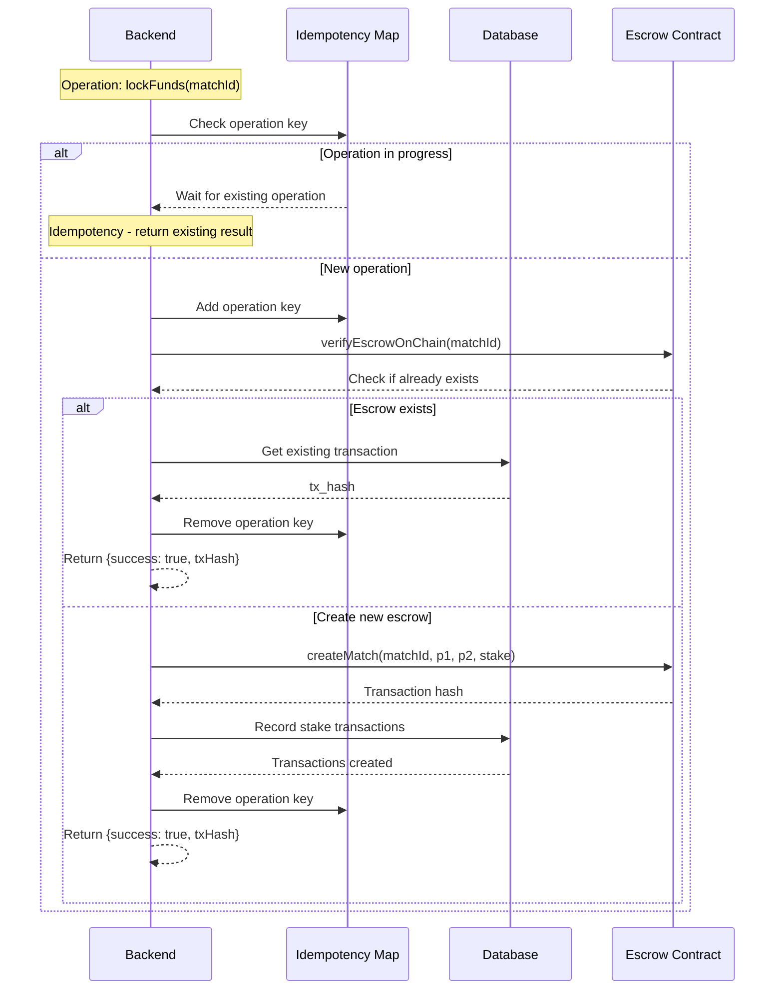

# Match Lifecycle Sequence Diagrams

This document illustrates the complete match lifecycle with state transitions, escrow operations, and error handling.

## Overview

The match lifecycle follows this deterministic state machine:

```
MATCHED → FUNDING → READY → STARTED → COMPLETED/CANCELLED/REFUNDED
```

Each state has specific entry/exit conditions and guards to ensure reliable transitions.

---

## 1. Happy Path: Successful Match



---

## 2. Error Path: Payment Timeout



---

## 3. Error Path: Disconnect Before Signal



---

## 4. Error Path: Disconnect After Signal



---

## 5. Reconnection Flow



---

## 6. State Machine Transitions



---

## 7. Escrow Operation Flow



---

## State Invariants

### MATCHED State
- **Invariants:**
  - Match exists in database
  - Players marked in Redis active_match
  - Both players have registered sockets

### FUNDING State
- **Entry Conditions:**
  - Stake > 0 (not free match)
- **Invariants:**
  - Payment timeout active
  - Tracking player1Staked, player2Staked
- **Exit Conditions:**
  - Both players paid AND escrow verified → READY
  - Payment timeout → CANCELLED
  - Partial payment + timeout → REFUNDED

### READY State
- **Entry Conditions:**
  - Free match OR (both paid AND escrow verified)
- **Invariants:**
  - Escrow funded (for paid matches)
  - Match start timeout active
- **Exit Conditions:**
  - Both ready AND both connected → STARTED
  - Disconnect or timeout → CANCELLED/REFUNDED

### STARTED State
- **Entry Conditions:**
  - Guards passed (both ready, both connected)
  - Escrow locked on-chain
- **Invariants:**
  - Signal will be sent within 2-5 seconds
  - Reaction timeout active (3 seconds post-signal)
- **Exit Conditions:**
  - Valid winner determined → COMPLETED
  - Both timeout or both false start → CANCELLED/REFUNDED
  - Disconnect → COMPLETED (other player wins) or REFUNDED (before signal)

### Terminal States (COMPLETED, CANCELLED, REFUNDED)
- **Invariants:**
  - No further transitions allowed
  - Redis tracking cleared
  - All timeouts cancelled

---

## Error Handling Matrix

| Scenario | State | Action | Next State |
|----------|-------|--------|------------|
| Payment timeout | FUNDING | Cancel + refund paid players | CANCELLED |
| Escrow verify fail | FUNDING | Cancel + refund | CANCELLED |
| Disconnect before signal | STARTED | Wait 30s, then refund | REFUNDED |
| Disconnect after signal | STARTED | Wait 30s, other player wins | COMPLETED |
| Both false start (1st) | STARTED | Rematch | STARTED |
| Both false start (2nd) | STARTED | Refund with fee | CANCELLED |
| Max reconnects exceeded | ANY | Cancel + refund | CANCELLED |
| Escrow creation fails | READY | Cancel + refund | CANCELLED |
| Contract tx reverts | ANY | Retry or refund | CANCELLED/REFUNDED |

---

## Metrics and Observability

### Key Events to Track
1. `match_created` - Match entered MATCHED state
2. `match_state_transition` - Any state change with from/to
3. `payment_received` - Player payment confirmed
4. `escrow_verified` - On-chain verification passed
5. `player_ready` - Player marked ready
6. `game_started` - Signal sent
7. `match_completed` - Winner determined
8. `match_cancelled` - Match cancelled at any stage
9. `refund_initiated` / `refund_completed` - Refund flow
10. `player_disconnected` / `player_reconnected` - Connection events

### Correlation IDs
Every match has a correlation ID for tracing:
```
match_${matchId}_${timestamp}
```

This allows full lifecycle tracing in logs:
```bash
grep "correlationId.*match_abc123" logs/production.log
```

---

## Additional Resources

- [Environment Variables](./ENVIRONMENT_VARIABLES.md)
- [Operator Runbook](./OPERATOR_RUNBOOK.md)
- [API Reference](./API_REFERENCE.md)
